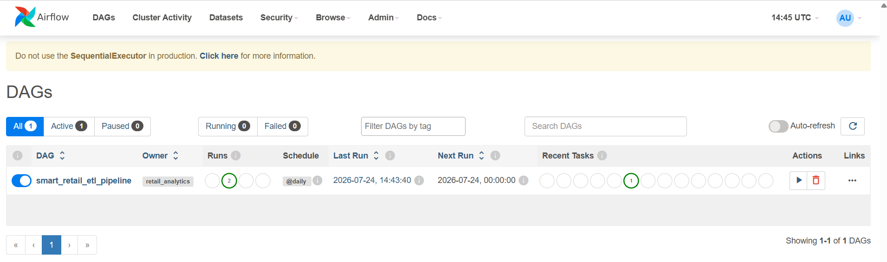
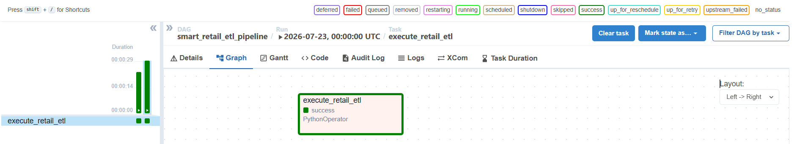
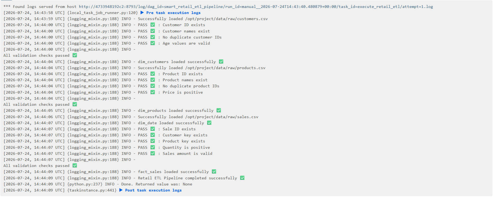
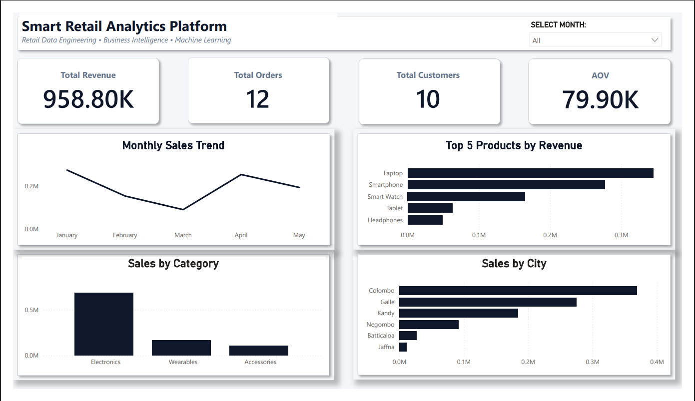
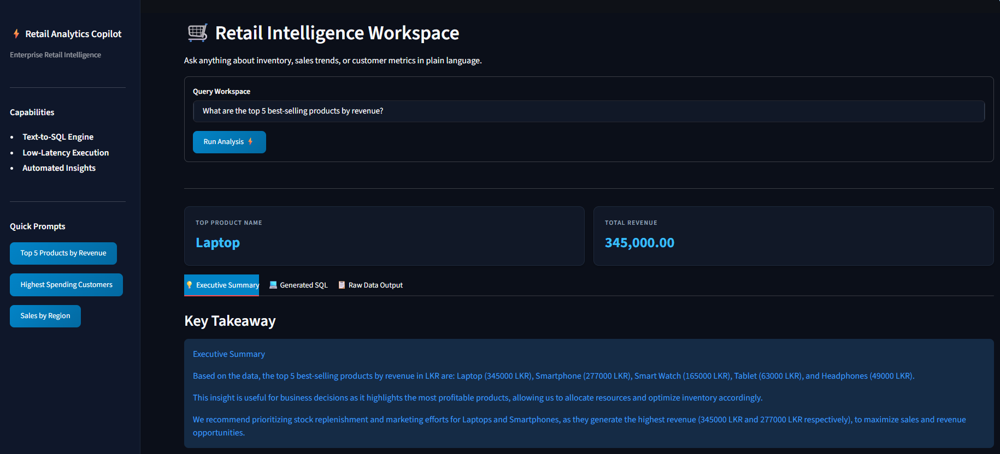

# 🛒 Smart Retail Analytics AI Copilot

An end-to-end **AI-powered retail analytics platform** combining Data Engineering, Business Intelligence, Workflow Orchestration, and Large Language Models (LLMs).

The system ingests raw retail transaction data, processes it through an automated ETL pipeline orchestrated with Apache Airflow, builds a PostgreSQL data warehouse using a star schema, provides interactive Power BI dashboards, and enables users to ask business questions through an LLM-powered analytics assistant.

The AI assistant automatically converts natural language questions into SQL queries, executes them against the warehouse, and generates business insights.

---

## 🏗️ System Architecture

```text
Raw Retail Data (CSV)
          │
          ▼
Python ETL Pipeline
          │
          ▼
Apache Airflow Orchestration
          │
          ▼
PostgreSQL Data Warehouse
(Star Schema)
          │
          ├──────────────────────┐
          ▼                      ▼
Power BI Dashboard        AI Analytics Copilot
                                  │
                                  ▼
                      Natural Language Query
                                  │
                                  ▼
                             Text-to-SQL
                                  │
                                  ▼
                         SQL Execution Engine
                                  │
                                  ▼
                    AI Business Insight Generation

```

---

## 🚀 Key Features

### Data Engineering Pipeline

* Automated data ingestion using Python
* Data cleaning and validation
* Dimensional modeling using Star Schema
* PostgreSQL data warehouse implementation
* Fact and dimension table management

## 🔄 Workflow Orchestration with Apache Airflow

The retail ETL pipeline is automated and monitored using Apache Airflow running through Docker containers.

Airflow manages the execution workflow by triggering the Python ETL pipeline and monitoring successful data loading into the PostgreSQL warehouse.

### Airflow Workflow Features

* Automated ETL pipeline scheduling
* DAG-based workflow management
* Pipeline execution monitoring
* Data validation tracking
* PostgreSQL warehouse loading
* Docker-based deployment environment

### Airflow Pipeline Execution Screenshots

#### Airflow DAG Overview




#### Airflow Graph View




#### Successful ETL Execution Logs



### Business Intelligence

* Interactive Power BI dashboard
* Sales performance analysis
* Customer analytics
* Product performance tracking
* Regional revenue insights

### AI Analytics Copilot

* Natural language business queries
* LLM-powered Text-to-SQL generation
* Automatic SQL execution
* AI-generated executive summaries
* Business recommendations from database insights

> **Example Interaction:**
> * **User:** What are the top 5 best-selling products by revenue?
> * **AI Summary:** Based on the data, top-selling products are led by Laptops and Smartphones, accounting for over 60% of total revenue.
> * **AI Recommendation:** Allocate more marketing resources to promote high-margin items like Laptops to maximize overall profitability.
> 
> 

---

## 🛠️ Technology Stack

* **Data Engineering:** Python, PostgreSQL, SQLAlchemy, Pandas
* **Business Intelligence:** Microsoft Power BI
* **Artificial Intelligence:** Large Language Models (LLMs), Groq API, Text-to-SQL, Prompt Engineering
* **Application Layer:** Streamlit
* **Workflow Orchestration:** Apache Airflow
* **Containerization:** Docker, Docker Compose
* **Development Tools:** Git, GitHub, VS Code

---

## 📂 Project Structure

```text
smart-retail-analytics/
│
├── data/
│   └── raw/
│
├── dashboard/
│   └── Smart_Retail_Analytics_Dashboard.pbix
│
├── screenshots/
│   ├── powerbi_dashboard.png
│   ├── ai_copilot.png
│   ├── airflow_dag.png
│   ├── airflow_graph.png
│   └── airflow_logs.png
│
├── airflow/
│   ├── dags/
│   │   └── retail_etl_dag.py
│   │
│   └── docker-compose.yml
│
├── src/
│   │
│   ├── ai/
│   │   ├── llm_client.py
│   │   ├── sql_generator.py
│   │   ├── sql_executor.py
│   │   ├── insight_generator.py
│   │   └── retail_assistant.py
│   │
│   ├── database/
│   ├── transformation/
│   ├── validation/
│   └── app/
│       └── ai_dashboard.py
│
└── README.md

```

---

## 📸 Screenshots

### Power BI Analytics Dashboard



### AI Analytics Copilot



---

## 💡 Example AI Questions

The AI assistant can seamlessly handle queries such as:

* *Which city generated the highest sales revenue?*
* *Which products generate the most revenue?*
* *Who are the highest spending customers?*
* *What are the main sales trends by quarter?*

---

## ⚙️ Installation & Setup

### 1. Clone Repository

```bash
git clone [https://github.com/Moinudeen-h/smart-retail-analytics.git](https://github.com/Moinudeen-h/smart-retail-analytics.git)
cd smart-retail-analytics

```

### 2. Create Environment

```bash
conda create -n retail_analytics python=3.11
conda activate retail_analytics

```

### 3. Install Dependencies

```bash
pip install -r requirements.txt

```

### 4. Configure Environment Variables

Create a `.env` file in the root directory:

```env
DATABASE_URL=your_postgresql_connection_string
GROQ_API_KEY=your_api_key

```

### 5. Run AI Analytics Copilot

```bash
streamlit run src/app/ai_dashboard.py

```

### 6. Run Airflow Pipeline

Navigate to the airflow directory:

```bash
cd airflow

```

Start Airflow using Docker Compose:

```bash
docker compose up

```

Access the Airflow dashboard at `http://localhost:8080`, then trigger the `smart_retail_etl_pipeline` DAG to execute the ETL workflow.

---

## 🎯 Project Objective

This project demonstrates the integration of modern **Data Engineering, Business Intelligence, Workflow Orchestration, and Generative AI technologies** to build an enterprise-style analytics platform capable of transforming raw business data into actionable intelligence.